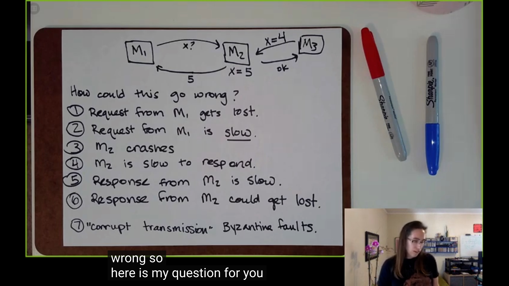

# Distributed Systems: What and Why?

The first question of distributed system is **what is a distributed system?**

By the definition of martin kleppmann (author of the famous book DDIA, Designing Data-Intensive Applications), **A distributed system is**

- running on serveral **nodes** connected by a network
- characterized by **partial failure**

partial failure means "some parts may be broken, others are ok".

There are two philosophies to think about partial failure: the **cloud computing** philosophy and the **high performance computing (hpc)**  philosophy.

- cloud computing treat partial failure as **expected** and work around it. 
  - when you have hundreds of thousands of computers, "Everything fails all the time".
- hpc treat partial failure as **total failure**, when something went wrong, we re-start the whole computing
  - we can use **checkpoint** to cope with failure. When the computing fails, we re-start at the newest checkpoint.

**Can we distinguish different kinds of failure?** Unfortunately, we can not.

As the figure shows, there are two machine taling about each other (just igonre the M3 in right upper location), the *M1* sent a request to query the value of a varible, say *x* which is stored in *M2*, but did't get the reply in a while.

**How could this go wrong?**

- Request from *M1* gets **lost** in the network, may be the network are disconnected 
- Request from *M1* is **slow**, may be the message is stuck in the network
- *M2* crashes
- *M2* is slow to respond 
- Response from *M2* is slow
- Response from *M2* is lost
- "Corrupt transmission", Byzantine Faults (for example, malicious one send wrong message)

In the view of ***M2***, it can **not distinguish** which kind of the failure is. 

If you send a request to another node and don't receive a response, it it **impossible** for you to know why!

And how do real systems try to cope with this ? With **timeout**, which means you wait for a certain amount of time, then assume failure and try again. But it'a an **imperfect** solution. 

For one reason, if the request is not just "query" or read a value, but want to do something, say change the variable, we call this things have a "side effect". For example, *M1* now wants to increase the *x* stored in *M2*. *M1* send the request,  but gets no response, *M1* has no idea wether the *x* is increased. 

For another reason, how long should the timeout be set ?  

Say we have a "perfect" network which ensures the request must arrive the receiver in *d* time. And luckily the receiver processes the message in *r* time. Then we can safely set the timeout to be *2d + r*. Whenever request times out, we believe the receiver is crashed.

But most of the time, we have no guarantee, we can't really do this. And palvaro characterizes distributed system as partial failure and unbounded latency. 

And there is the last question, **Why deal with all this pain?** In other word, what can we get from distributed system?

- we want to make things faster
  - we have more computers, there is more potential parallisim we can take advantage of
- more data than can fit on one machine
  - There are so much data, which need several hundred thousand disks to store. We can not plug all the disks into only one computer
-  reliability
  - the datacenter save serval copies of your data to ensure they are not lost when failure occurs.
- throughput 
  - more well-structured computers can gives higher throughput. You can use different machines to cope with requests from different places.
