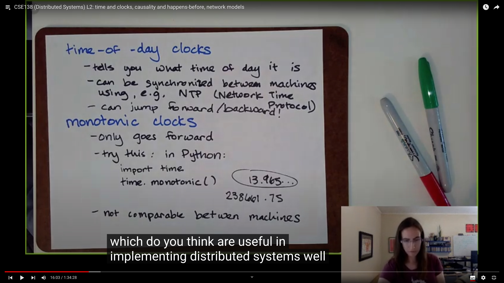

# Time&Clocks,Network Model,Causality,State & Events

## Agenda


Today we going to talk about the following topics:

- Time and clocks
- Lamport diagrams
- Network models
- casuality and happens-before
- state and events

## Clock


For the first one,  consider the question: **what do we use clocks for ?** 

- Scheduling, we use clock to **mark points in time** , i.e. "This class starts at 3:20pm PT", "This item in my browser cache expires on April 1, 2021 at 8pm PT", or "This error message in errors.txt has a timestamp of on April 1, 2021"
- **Durations / Intervals of time**, we use clock to measure how long will something take, i.e. "This class is 95 minutes long", "This request will time out in 5 seconds"



We have two kinds of clock for each usage, the **time-of-day clocks** and the **monotonic clocks**

the **time-of-day clocks**:

- tells you what time of day it is
- can be synchronized between mahcines using e.g. NTP(Network Time Protocol)
- But we **cannot** use this for measure durations of time, because it can jump forward or backward!

the **monotonic clocks**:

- only goes forward

- is not comparable between machines.

  ```python
  # A python example of monotonic clock
  >>> import time
  >>> time.monotonic()
  18972.169906637 
  # the return value depends to the uesr's machine
  ```


These two kinds of clocks are both we called **physical clocks**

|  physical clocks   | points in time | intervals/durations |
| :----------------: | :------------: | :-----------------: |
| time-of-day clocks |  ok, not good  |         bad         |
|  monotonic clocks  |      bad       |        good         |

for time-of-day clocks, it's bad to measure the duration of time. Unfortunately it is also not well to measure the points in time, because there is no perfect approach to exactly synchronize the time of different machines. NTP is not perfect. 

For example, *M1* and *M2* both have a variable *x* , with the value of 5. In 3pm, *M1* send *M2* a request to increase *x*. In *M1* view, before 3pm they both have that *x = 5*. Due to the imperfect time-synchronize approch, they have different "3pm", which makes *M2* has that *x = 6* before 3pm

## Logic Clock, Happens-before


Instead of using physical clock, we are going to introduce the **logic clocks**, which only measure the order of events.

First we define a notation: A $$\rightarrow$$ B, pronounced as A happened before B, where A and B are arbitrary events.

What does A $$\rightarrow$$ B tell us about **causality**? 

- A could have caused B, maybe or maybe not, we don't know,
- But we know that B **could not** have caused A


 And we use a new way to draw the picture, which is called **Lamport diagrams** .

The horizontal line represents a process, and time flows from up to bottom. Event is represented by dot in the line. And the arrrow between two line represents the message passing between two processes.

With lamport diagram, we can give a formal definition of happens before:

Given events A and B, we say   A $$\rightarrow$$ B :

- if A and B occur on the same process with A before B, then  A $$\rightarrow$$ B, e.g. in the lamport diagram,  X $$\rightarrow$$ Z on *M1*
- if A is a send event and B is the corresponding receive event, then  A $$\rightarrow$$ B. e.g, P $$\rightarrow$$ S , P is the send event of *M2* and S is the receive event of 

- transitive: Given some other event C such that  A $$\rightarrow$$ C and  C $$\rightarrow$$ B, then  A $$\rightarrow$$ B, e.g. S $$\rightarrow$$ Y and Y $$\rightarrow$$ Z, we have S $$\rightarrow$$ Z

Notes that event R in *M0* and event Z in *M1*, we have no idea which one happens before, which means Z $$\not \rightarrow$$ R and R $$\not \rightarrow$$ Z, we say R and Z are **concurrent** . 


Why do we need the lamport diagram? There is an example as in the screenshot. 

Alice says "Bob smells", and Bob responses with "Fuck you Alice!". But due to the unbounded latency, Carol get the Bob's response first. In the view of Carol, Bob says "fuck" first and Alice response later. This is a causal anomaly.

## Network Model


Next we are going to introduce the network models.

- A **synchronous** network is one where there exists an **n** such that no message takes longer than n units of time to be delivered.

- An **asynchronous** network is one where there exists **no n** such that no message takes longer than n units of time to be delivered.  

synchronous network do exist, but **in reality we deal with asynchronous network**, and we want to design a robust protocol which can still work well in the bad situation.

## State and Events


State is like the the varible of *x*, or some machine state we care about. Event is the dot in lamport diagram.

Like the example, we can save all the event happens in *M2* as log. When we replay the log, we get the current state of *M2* again, in this case we get *x=6* by replay the log. If we know the state of *M2*, can we reconstruct the log? Certainly not, some events have no side-effect, say they do not change the value of *x*, they just query the value. We have no idea how many such requests may happen just from the current state.   
