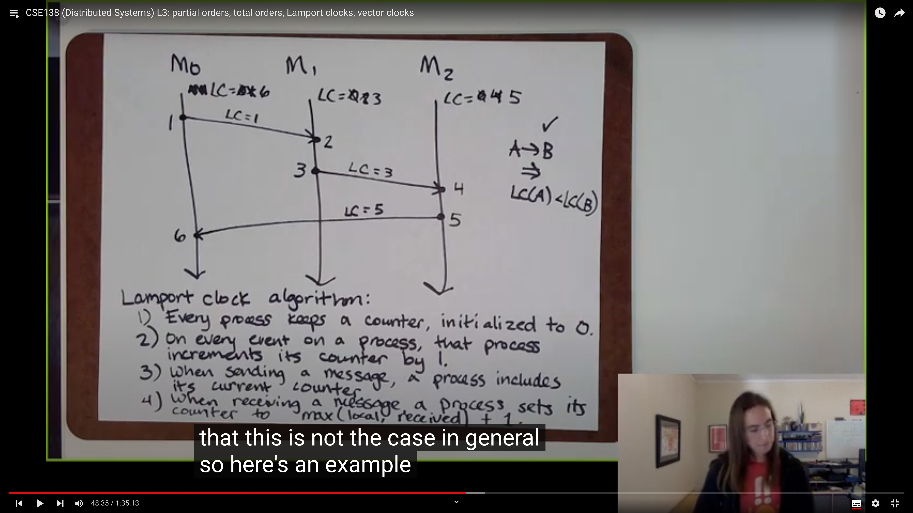

# Partial Orders, Total Orders, Lamport Clocks, Vector Clocks

## Agenda

In this lecture, we are going to cover the following topics:

* recap of happens-before relation
* partial orders and total orders
* Lamport clocks
* vector clocks

In [last lecture](lecture02.md), we defined the "happen-before" relation:

> Given events A and B, we say A $$\rightarrow$$ B :
>
> * if A and B occur on the same process with A before B, then A $$\rightarrow$$ B.&#x20;
> * if A is a send event and B is the corresponding receive event, then A $$\rightarrow$$ B.&#x20;
> * transitive: Given some other event C such that A $$\rightarrow$$ C and C $$\rightarrow$$ B, then A $$\rightarrow$$ B.

In this example, we know that A $$\rightarrow$$ E , but we have no idea about the relationship of A and D, A $$\not \rightarrow$$ D and D $$\not \rightarrow$$ A, we say A and D are concurrent, denote as A || D .

## Partial Order

"happens-before" is a kind of partial order.

**Partial Order** is defined as:

* A set of S, together with
* A binary relation, often written $$\le$$ , that lets you compare elements of S, and has the following properties:
  * Reflexivity: for all a $$\in$$ S, a $$\le$$ a
  * Anti-symmetry: for all a,b $$\in$$ S, if a $$\le$$ b and b $$\le$$ a, then a $$=$$ b
  * Transitivity: for all a,b, c $$\in$$ S, if a $$\le$$ b and b $$\le$$ c , then a $$\le$$ c

This is an example of a partial order.

We have a set S, which is consisted of all the subset of Set $$\{a,b,c\}$$. S is out set, and we define the binary relation, called set inclusion and denoted by $$\le$$, as if all the elements in A belongs to B, then A $$\le$$ B. Note that a partial order is two-tuple, the binary relation and the set where it applies. For brevity, we call this example set inclusion.

Now we claim set inclusion is a partial order. We need to check whether set inclusion satisfies three properties. It's obvious, our claim is true, and set inclusion is a partial order.

Now let's talk about the happens-before. The set where happens-before applies is all the events in the lamport diagram. And we check the three properties:

* According to the definition of happens-before, it's easy to know that happens-before is transitive. Transitivity satisfied.

For other properties, it's a liitle bit trick to check.

* In happens-before, say we have A $$\rightarrow$$ B, then B $$\rightarrow$$ A is impossible. So we never meet the situation described in anti-symmetry property, it's vacuously satisifed.
* In reflexivity property, A $$\rightarrow$$ A doesn't make sense. We think it's not satisfied. A little weird :)

Actually, happens-before is a kind of **strict partial order**, the difference between strict partial order and (non-strict) partial order is the reflexivity property. In strict partial order, the reflexivity property is replaced by the irreflexivity property, which requires that no element is related to itself, such as A is not happens-before A. In practice, however, we just say happens-before is a kind of partial order.

**Note** that in happens-before example, A and D are concurrent, which means: A $$\not \rightarrow$$ D and D $$\not \rightarrow$$ A. In fact A and D are not "comparable" in happens-before relationship. This is the key **difference** between **total order** and **partial order**.

Mathmatically, a partial order relation is any relation that is reflexive, antisymmetric, and transitive. **A total order relation is a partial order in which every element of the set is comparable with every other element of the set**.

The natural number set with less equal $$\le$$ is an example. Clearly, the less equal satisfied three properties, and for any number n and m, either n $$\le$$ m or m $$\le$$ n.

## Lamport Clock

In last lecture, we mentioned two kinds of physic clocks, the time-of-day clocks and monotonic clocks. In distributed system, we use **logical clocks** which only represents the ordering of events.

**Lamport Clocks** is a kind of logical clock, for example,LC(A) = 3 means the lamport clock of event A is 3, the value of lamport clock is just an integer. And we use the lamport clock algorithm to count the lamport clock.

**Lamport Clock Algorithm:**

* Every process keeps a counter, initialized to 0.
* On every event on a process, that process increments its counter by 1
* When sending a message, a process includes its current counter
* When receving a message, a process sets its counter to max(local, received) + 1

Following the algorithm, it's easy to compute the LC of every events in the picture.

With lamport clocks, we have a "clock condition": if A $$\rightarrow$$ B, then LC(A) < LC(B). But it's possible to have LC(A) < LC(B) but A dosen't happens-before B.

We say lamport clocks are **consistent with causality** which means if we know A $$\rightarrow$$ B , then we know LC(A) < LC(B), but not the vice verse.

But by the contrapositive rule, we have if not LC(A) < LC(B) then not A $$\rightarrow$$ B, which is if LC(A) $$\ge$$ LC(B), then A $$\not \rightarrow$$B

We say **logical clocks are consistent with causality:** A $$\rightarrow$$ B $$\Rightarrow$$ logical clock of A < logical clock of B.

And we say logical clocks are **characterized** with causality: logical clock of A < logical clock of B $$\Rightarrow$$ A $$\rightarrow$$ B.

Lamport clocks are consistent with causality but not characterized by causality.

## Vector clocks

For vector clocks, A $$\rightarrow$$ B $$\Leftrightarrow$$ VC(A) < VC(B), which means vector clocks are both consistent and characterized with causality.

**Vector Clocks:**

* Every process keeps a vector (length N for N processes), initialized to zeros.
* On every event, a process increments its own position in its vector clock (all events: sends, receives and internal events)
* When sending a message, a process includes its current vector clock. (After the increment)
* When receiving a message, a process updates its vector clock to max(local, received)
